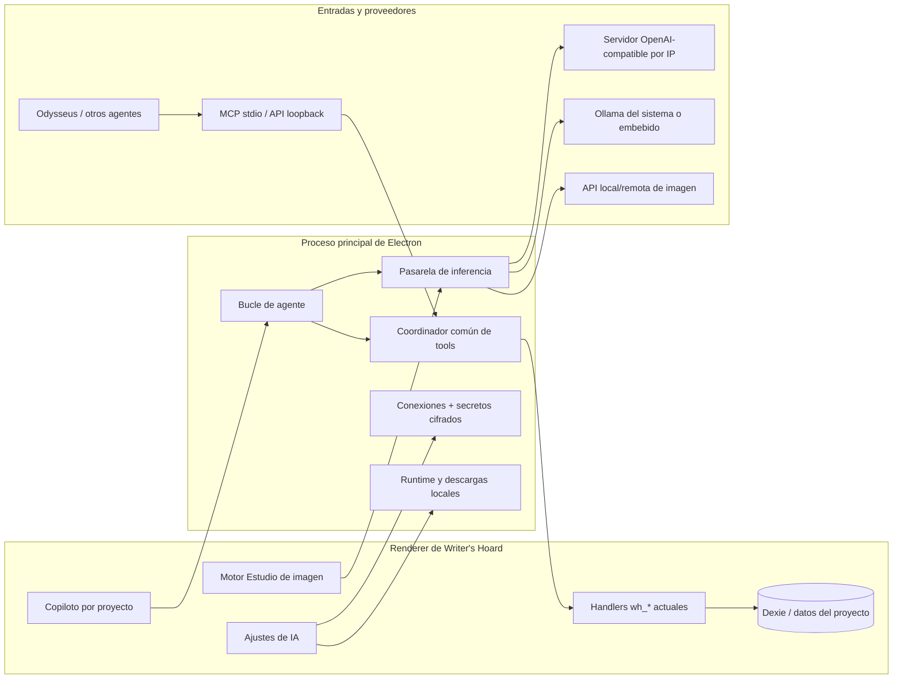

# Plan de implementación de IA nativa en Writer's Hoard

**Fecha del estudio:** 2026-08-31  
**Estado:** propuesta de arquitectura lista para dividir entre agentes  
**Codebases revisadas:** Writer's Hoard y `D:\LocalAI\odysseus`

## 1. Resultado propuesto

Writer's Hoard debe tener una sola plataforma de IA con dos puertas de entrada:

1. **Copiloto interno**, visible como panel derecho por proyecto.
2. **Puente externo**, accesible desde Odysseus y otros clientes mediante el
   MCP que ya existe.

Las dos puertas deben invocar el mismo manifiesto, los mismos handlers, las
mismas validaciones, confirmaciones, auditoría y operaciones de undo. El MCP no
se elimina, no se sustituye y no se reimplementa dentro del chat. El chat usa el
núcleo común directamente, mientras que MCP sigue siendo uno de sus transportes.

La otra mitad de la plataforma es una pasarela de inferencia en el proceso
principal de Electron. Esa pasarela conecta servidores por IP/URL, gestiona el
Ollama embebido actual, descubre modelos, transmite respuestas, protege secretos
y, más adelante, sirve tanto texto como imagen.



## 2. Decisiones que no deben cambiar durante la implementación

- El manifiesto `BRIDGE_TOOLS` y `TOOL_HANDLERS` es el punto de partida de la
  API de la aplicación. No se creará una segunda familia de herramientas para el
  copiloto.
- El copiloto interno no necesita que el puerto MCP esté activado. Ambos
  comparten el núcleo situado detrás del transporte; el puerto externo continúa
  apagado por defecto y ligado a `127.0.0.1`.
- Toda red de IA sale desde Electron main. El renderer no recibe claves ni hace
  `fetch` directo a endpoints configurables.
- La primera versión admite dos adaptadores: **OpenAI-compatible** y **Ollama**.
  Los proveedores nativos adicionales se añaden después, sin condicionales
  repartidos por la UI.
- Un modelo sin function calling nativo puede conversar, resumir o analizar,
  pero no controlar la app. No se interpretará texto libre como si fueran tool
  calls en la primera versión.
- No se envía automáticamente un proyecto completo al modelo. El modelo recibe
  contexto pequeño y usa tools acotadas para buscar y leer.
- Las conexiones son globales; la conversación, el modelo elegido y el permiso
  para enviar datos remotos son configurables por proyecto.
- Los modelos y runtimes descargados no viajan en los backups. Conversaciones,
  preferencias del proyecto y metadatos/procedencia de imágenes sí.
- El trabajo de Odysseus sirve como referencia de producto y protocolo. No se
  copiará código AGPL a Writer's Hoard sin una decisión expresa de licencia.

## 3. Estado actual comprobado

### 3.1 Writer's Hoard

| Área | Implementación actual | Consecuencia para el plan |
|---|---|---|
| Configuración de IA | `src/config/ai.ts`, `src/stores/aiStore.ts` y `AiConfig` en `src/types/index.ts` distinguen solo `proxy` y `local`. | Hay que migrar a conexiones identificadas por ID sin romper los ajustes actuales. |
| Proxy por IP | `src/services/aiService.ts` llama desde el renderer a `/v1/chat/completions` y prueba `/v1/models`. | Se conserva el protocolo, pero se mueve la red a Electron main. |
| IA local | `electron/ollama.ts` detecta Ollama del sistema, descarga un runtime portable verificado, arranca un hijo controlado y permite pull/delete/chat. | Es una base valiosa; debe convertirse en un adaptador, no reescribirse. |
| Catálogo local | `LOCAL_MODELS` tiene dos tags y tamaños duplicados en renderer/main. | Sustituir por un manifiesto compartido con capacidad, tamaño, contexto y fit. |
| Funciones de IA | `aiFeatures.ts` y `AiToolbar.tsx` implementan resumen y extracción de personajes en una sola llamada. | Mantener su UX y migrarlas a la pasarela común como clientes de compatibilidad. |
| MCP externo | `electron/aibridge/*`, `src/services/aiBridge/*` y `docs/AI-BRIDGE.md` exponen decenas de tools con grupos, token, escrituras, auditoría, undo y confirmación de borrado. | Es el núcleo funcional que debe reutilizar el copiloto. |
| Ejecución de tools | El handler real corre en renderer mediante `runBridgeTool`; política y auditoría viven dentro del servidor HTTP. | Extraer un coordinador común en main para que MCP y copiloto no diverjan. |
| Contexto abierto | `wh_get_context` lee `useAppStore.currentProjectId`, pero no existe un llamador actual de `setCurrentProject`. | Corregir antes del copiloto; hoy el contexto implícito puede decir que no hay proyecto abierto. |
| Shell | `MainLayout.tsx` monta sidebar + outlet. `ProjectDetail.tsx` compone cockpit/motor y `Sidebar.tsx` contiene navegación global y de proyecto. | El panel derecho pertenece al shell; Ajustes de IA debe ser una ruta global del sidebar. |
| Persistencia | Dexie está en v26. `settings` guarda pares string; no hay conversaciones. | Añadir tablas de chat/preferencias con backup y migración. |
| Imágenes | Gallery guarda `InspirationImage` en Dexie, crea miniaturas y externaliza binarios en el ZIP. | El estudio de imagen debe guardar resultados en Gallery con procedencia, no crear otro almacén de assets. |
| Seguridad | CSP, renderer sandboxed, allowlist IPC, paths confinados, runtimes fijados por hash y procesos hijos controlados. | Toda nueva IPC, descarga y sidecar debe conservar estas barreras. |

### 3.2 Odysseus

Los patrones relevantes están en:

- `core/database.py::ModelEndpoint`: URL, clave cifrada, caché de modelos,
  modelos fijados/ocultos, tipo `llm|image`, clase de endpoint, refresco y
  capacidad de tools.
- `routes/model_routes.py`: normalización, deduplicación, sondeo explícito,
  caché-first, backoff, latencia y CRUD de endpoints.
- `src/endpoint_resolver.py`: composición correcta de las rutas de chat/modelos
  para OpenAI-compatible y Ollama.
- `services/hwfit/*` y `routes/hwfit_routes.py`: detección de hardware,
  agrupación de GPU homogéneas, estimación de memoria/contexto/velocidad,
  perfiles y ranking de modelos de texto e imagen.
- `routes/cookbook_routes.py`: descarga, instalación y servicio de modelos,
  incluidos hosts remotos. Es potente, pero depende de shell, tmux, SSH,
  Docker, Python y varios backends.
- `scripts/diffusion_server.py`: API OpenAI-compatible de imagen con
  `/v1/models`, `/v1/images/generations`, edición y progreso.
- `src/ai_interaction.py::do_generate_image`: resolución de endpoint, llamada a
  `/images/generations`, tratamiento de base64/URL y guardado local.
- `src/mcp_manager.py`: Odysseus consume stdio, SSE y Streamable HTTP, y usa
  anotaciones MCP para clasificar tools de solo lectura.

#### Qué se reutiliza y qué no

| Decisión | Elementos |
|---|---|
| Reutilizar directamente | El MCP ya compilado de Writer's Hoard y sus contratos públicos. El runtime Ollama de Writer's Hoard. Protocolos HTTP OpenAI-compatible. |
| Adaptar/reimplementar | Registro de endpoints, sondeos, caché/backoff, modelo de capacidades, UX de Cookbook, HW Fit y ranking de imagen. |
| No trasladar en bloque | Cookbook, ejecución shell, SSH/tmux/Docker, base de datos Python y servidor FastAPI completo. |
| Revisar licencia | Odysseus tiene licencia AGPL-3.0. Su adaptación de `llmfit` reconoce MIT, pero las modificaciones de Odysseus y `diffusion_server.py` no deben copiarse sin aclarar derechos/obligaciones. La ruta segura es una implementación TypeScript limpia basada en contratos y, para HW Fit, en la fuente MIT original con atribución. |

## 4. Arquitectura objetivo

### 4.1 Contratos compartidos

Crear un paquete puro, importable por renderer y Electron, sin DOM, Dexie ni
Node. Nombre recomendado: `src/services/aiRuntime/`.

```ts
type AiConnectionKind = 'openai-compatible' | 'ollama';
type AiModelType = 'chat' | 'image';
type AiCapability =
  | 'chat'
  | 'streaming'
  | 'tools'
  | 'vision'
  | 'image-generation'
  | 'image-editing'
  | 'inpainting';

interface AiConnectionSummary {
  id: string;
  name: string;
  kind: AiConnectionKind;
  baseUrl: string;
  enabled: boolean;
  hasSecret: boolean;
  locality: 'embedded' | 'loopback' | 'lan' | 'remote';
  status: 'unknown' | 'online' | 'loading' | 'offline' | 'error';
  latencyMs?: number;
  lastCheckedAt?: number;
}

interface AiModelDescriptor {
  connectionId: string;
  id: string;
  type: AiModelType;
  capabilities: AiCapability[];
  contextWindow?: number;
  sizeBytes?: number;
  parameterCountB?: number;
  quantization?: string;
  installed?: boolean;
}

interface AiRouteSelection {
  connectionId: string;
  modelId: string;
}
```

Las interfaces de adaptador deben normalizar `listModels`, `probe`, `chat`,
`generateImage`, `cancel` y eventos de progreso. Ningún componente de React
construye URLs de proveedor.

### 4.2 Registro de conexiones y secretos

- Guardar metadatos no secretos en `<userData>/ai/connections.json` mediante
  escritura atómica.
- Cifrar API keys con `electron.safeStorage`; guardar solo el ciphertext.
- Si el cifrado no está disponible, permitir una clave solo en memoria o
  rechazar su persistencia con una explicación clara.
- El renderer recibe `hasSecret` y una huella corta, nunca la clave.
- La inferencia recibe `connectionId`, no una URL arbitraria.
- Mantener un endpoint embebido con ID estable para Ollama. La detección de
  Ollama del sistema sigue funcionando como hasta ahora.

### 4.3 Pasarela de inferencia

Ubicación recomendada: `electron/ai/`.

- `connectionStore.ts`: persistencia, cifrado, migración y deduplicación.
- `urlPolicy.ts`: normalización y política de red.
- `adapters/openAiCompatible.ts`: modelos, streaming, tool calls e imagen.
- `adapters/ollama.ts`: fachada sobre `electron/ollama.ts`.
- `inferenceGateway.ts`: resolución de conexión/modelo, timeout, cancelación,
  límites y errores normalizados.
- `agentLoop.ts`: turnos de copiloto, selección de tools y límites del bucle.

El canal de streaming debe usar IDs de petición y eventos tipados:
`started`, `delta`, `tool-proposed`, `tool-running`, `tool-result`, `usage`,
`done`, `cancelled`, `error`. Cerrar el panel no cancela por accidente; el botón
Cancelar sí.

### 4.4 Núcleo único de herramientas

Extraer de `electron/aibridge/server.ts` un coordinador, por ejemplo
`electron/aibridge/executor.ts`:

```text
executeTool(call, executionContext)
  -> buscar definición en BRIDGE_TOOLS
  -> validar esquema y política del origen
  -> solicitar aprobación cuando corresponda
  -> callRenderer(tool, args)
  -> registrar auditoría para mutaciones
  -> retirar __audit de la respuesta
  -> devolver resultado normalizado
```

`executionContext` debe transportar como mínimo `origin`, `projectId`,
`conversationId`, `actionPolicy` y `clientLabel`. Para el copiloto, el
coordinador inyecta el proyecto cuando el esquema admite `projectId` y rechaza
un ID distinto. Los handlers que reciben solo un ID de entidad deben pasar por
un helper común `assertExecutionScope(entity.projectId)` después de resolverla.
El scope no es solo una instrucción en el prompt.

Orígenes iniciales:

- `mcp-stdio` / `bridge-http`: respetan `enabled` y `writesEnabled` actuales.
- `internal-copilot`: respeta la política de la conversación.
- `internal-feature`: llamadas de resumen/extracción sin tools de escritura.

La ejecución de datos sigue en renderer porque Dexie es autoritativo. La
coordinación, política y auditoría quedan en main. `server.ts` pasa a ser solo
transporte HTTP y `mcpStdio.ts` sigue siendo el adaptador MCP externo.

Extender `BridgeTool` de forma compatible con:

- `risk: 'read' | 'ui' | 'write' | 'destructive' | 'external-cost'`;
- anotaciones MCP `readOnlyHint`, `destructiveHint` e `idempotentHint`;
- opcional `resultLimitBytes` y `requiresCapability`.

`writes` se conserva mientras existan clientes y pruebas que dependan de él.

### 4.5 Selección de tools para modelos pequeños

No enviar las ~88 tools actuales en cada turno.

1. Incluir siempre un núcleo pequeño: contexto, búsqueda y navegación.
2. Incluir tools del motor abierto y de los motores habilitados relevantes.
3. Recuperar por nombre/descripción un máximo configurable, inicialmente 16.
4. No incluir tools de escritura cuando la conversación sea read-only.
5. Detener tras 8 rondas o 20 llamadas; una repetición idéntica fallida no se
   reintenta automáticamente.

En un chat de proyecto, `wh_list_projects` queda fuera del núcleo por defecto y
solo se recupera ante una intención explícita de trabajo entre proyectos.

La selección inicial puede ser léxica y determinista. No hace falta introducir
embeddings para poder lanzar el copiloto.

### 4.6 Persistencia por proyecto

Siguiente versión Dexie sugerida: v27.

| Tabla | Índices mínimos | Contenido |
|---|---|---|
| `aiThreads` | `id, projectId, updatedAt, archived` | Título, ruta/modelo elegidos, timestamps. |
| `aiMessages` | `id, threadId, projectId, createdAt, role` | Markdown, estado, procedencia del modelo y tool cards acotadas. |
| `aiProjectSettings` | `projectId, updatedAt` | Modelo de texto/imagen, consentimiento remoto y política de acciones. |

Registrar un backup simple `ai-assistant` para estas tablas e importarlo durante
la inicialización del registro. No guardar claves, respuestas binarias completas,
modelos descargados ni razonamiento oculto del proveedor.

Una tool call persistida debe conservar nombre, argumentos saneados, estado,
resumen del resultado y el índice de auditoría/undo; no debe duplicar cuerpos
completos de capítulos devueltos por una tool.

### 4.7 Ajustes de IA en el panel izquierdo

Añadir la ruta global `/settings/ai` y un botón siempre visible en `Sidebar.tsx`.
El modal general conserva idioma y ajustes no relacionados; las secciones
actuales de IA y `AiBridgePane` se trasladan, no se duplican.

La página tiene cuatro secciones:

1. **Conexiones**: alta por IP/URL, nombre, adaptador, clave opcional, tipo de
   modelos, test, latencia, estado y capacidades.
2. **Modelos locales**: hardware detectado, catálogo texto/imagen, fit,
   descarga, progreso, cancelación, selección y borrado seguro.
3. **Valores por defecto**: rutas globales de texto, tools, visión e imagen.
4. **Acceso externo (MCP)**: el `AiBridgePane` actual, config copiable,
   read/write, auditoría y undo.

El asistente de conexión debe aceptar `host:puerto`, `http(s)://host:puerto` y
rutas base con `/v1`, normalizarlas y mostrar la URL final antes de guardar.
"ChatGPT por IP" significa aquí un servidor o proxy que exponga una API
compatible; no la interfaz web de ChatGPT.

Ofrecer además **Detectar en este equipo**: una acción manual que prueba en
paralelo una allowlist corta de puertos loopback conocidos (Ollama, LM Studio,
llama.cpp/vLLM). No escanear toda la LAN ni iniciar sondeos silenciosos al abrir
la app; las IP de otros equipos se añaden explícitamente.

### 4.8 Copiloto derecho por proyecto

Montar `CopilotDock` en `MainLayout`, visible solo en rutas `/project/:id/*`.
Debe ser colapsable y redimensionable, con ancho persistido y modo overlay en
ventanas estrechas.

Contenido mínimo:

- selector de conversación y botón nueva;
- modelo/conexión activos y badge `Local`, `LAN` o `Remoto`;
- historial Markdown saneado;
- cards de tools con propuesta, aprobación, resultado, error y undo;
- composer, chips de contexto explícito, enviar/cancelar;
- aviso claro cuando el modelo conversa pero no puede usar tools;
- acceso rápido a Ajustes de IA cuando no hay modelo disponible.

El proyecto se deriva de la ruta. El montaje del dock también debe sincronizar
`currentProjectId`, reparando el hueco actual del MCP. Cambiar de proyecto cambia
de hilo y contexto, no mezcla mensajes.

Permisos internos:

- **Solo lectura**.
- **Preguntar antes de cambiar** (valor por defecto).
- **Permitir cambios reversibles en este chat**.

Borrados y operaciones con posible coste externo siempre requieren confirmación.
El MCP conserva su propio interruptor global de escritura para no cambiar el
contrato existente.

### 4.9 Motor de imagen

Registrar un motor tableless `image-studio`. Usa la tabla de Gallery como
almacén canónico y muestra las imágenes generadas aunque Gallery no esté
habilitado como pestaña separada.

Extender `InspirationImage` de forma aditiva:

```ts
source?: 'uploaded' | 'generated';
generation?: {
  prompt: string;
  negativePrompt?: string;
  connectionId: string;
  modelId: string;
  seed?: number;
  width: number;
  height: number;
  quality?: string;
  createdAt: number;
};
```

El estudio incluye prompt, modelo, relación de aspecto, calidad/pasos que el
adaptador soporte, número de variantes, progreso, cancelar, regenerar y guardar
en colección. Opciones no soportadas no se simulan: se ocultan o deshabilitan.

Añadir `wh_generate_image` al grupo `visual`. La tool genera mediante la misma
pasarela, guarda el resultado en `inspirationImages` y devuelve IDs más una
miniatura MCP, nunca el base64 completo dentro del JSON textual.

#### Runtime local de imagen

Desarrollarlo como componente opcional independiente, empezando por
Windows/NVIDIA, porque el runtime Ollama embebido actual también es Windows-only.

- Runtime y dependencias fijados por versión, tamaño y SHA-256.
- Catálogo allowlist de modelos con revisión inmutable, licencia, tamaño,
  capacidades y requisitos de VRAM.
- `trust_remote_code=false`; no ejecutar scripts de un repositorio de modelo.
- Descarga reanudable a staging, verificación y promoción atómica.
- Un solo trabajo GPU simultáneo; hijos registrados y tree-kill al cancelar o
  cerrar la app.
- Worker local con puerto efímero/token o canal stdio; nunca una API abierta.
- API interna compatible con el adaptador de imagen, para que un modelo
  descargado y un servidor por IP tengan la misma experiencia de uso.

No trasladar `diffusion_server.py` sin más. Extraer primero un contrato y crear
una implementación propia o resolver expresamente la licencia.

## 5. Plan por fases

### Fase 0 — Baseline, decisiones y pruebas de caracterización

**Objetivo:** congelar el comportamiento que no puede romperse.

Tareas:

- Ejecutar la verificación actual y guardar sus resultados.
- Añadir una prueba que demuestre el proyecto/motor abierto en
  `wh_get_context`; corregir la sincronización de `currentProjectId`.
- Caracterizar MCP stdio, HTTP, read-only, writes, borrado confirmado, auditoría
  y undo antes del refactor.
- Confirmar los protocolos MVP: OpenAI-compatible y Ollama para texto;
  OpenAI-compatible Images para imagen.
- Crear ADRs breves para almacenamiento de secretos, política remota y runtime
  local de imagen.
- Decidir por escrito la estrategia de licencia antes de reutilizar código de
  Odysseus.

**Salida:** suite roja ante cualquier regresión del puente actual y decisiones
cerradas.  
**Puerta:** ninguna implementación posterior comienza sin el baseline verde.

### Fase 1 — Núcleo de tools compartido, sin cambio de producto

**Objetivo:** convertir el MCP actual en una API de aplicación independiente del
transporte.

Tareas:

- Crear el coordinador `executeTool` en Electron main.
- Mover a él el lookup, permiso de escritura, auditoría, inferencia de
  create/update/delete y retirada de `__audit`.
- Mantener los handlers y Dexie en renderer.
- Hacer que `aibridge/server.ts` delegue en el coordinador.
- Añadir `risk` y anotaciones MCP; emitirlas desde `mcpStdio.ts`.
- Añadir validación estructural de argumentos antes del handler.
- Mantener exactamente las variables, puerto, token, grupos y mensajes de error
  públicos actuales.

**Aceptación:** el self-test y clientes MCP actuales observan el mismo
comportamiento; una llamada simulada de origen `internal-copilot` produce la
misma mutación y auditoría que la llamada MCP equivalente.  
**Dependencias:** Fase 0.

### Fase 2 — Registro de conexiones y pasarela de inferencia

**Objetivo:** conectar por IP/URL y unificar el Ollama actual.

Tareas:

- Crear contratos puros y store nativo de conexiones.
- Implementar cifrado de secretos y respuestas renderer sin secretos.
- Implementar normalización de URL, deduplicación y clasificación
  embedded/loopback/LAN/remota.
- Implementar adaptadores OpenAI-compatible y Ollama.
- Descubrir modelos con caché-first, refresco explícito y backoff.
- Sondear latencia y capacidades; permitir fijar modelos manualmente cuando
  `/models` no exista.
- Implementar streaming/cancelación y errores normalizados.
- Mover `callAi` detrás de la pasarela, conservando `AiToolbar` y
  `aiFeatures.ts`.
- Migrar idempotentemente `ai_provider`, `ai_base_url`, `ai_model` y
  `ai_local_model`; conservar las claves antiguas durante dos versiones.
- Registrar y autorizar todos los canales nuevos en preload y `security.ts`.

**Aceptación:** las funciones existentes trabajan con el proxy actual y con
Ollama sin `fetch` de IA desde renderer; una clave no aparece en IPC, logs,
Dexie ni mensajes de error.  
**Dependencias:** Fase 0. Puede avanzar en paralelo con Fase 1 si un agente es el
único propietario de los hotspots IPC.

### Fase 3 — Ajustes de IA, hardware fit y biblioteca de modelos

**Objetivo:** ofrecer la experiencia sencilla inspirada en Odysseus.

Tareas:

- Añadir `/settings/ai` al router y al sidebar.
- Trasladar la configuración actual de IA y `AiBridgePane` a la nueva página.
- Implementar CRUD/test/modelos/capacidades de conexiones.
- Añadir detección manual y acotada de servidores en loopback, sin escaneo LAN
  automático.
- Implementar detector de CPU, RAM disponible, GPU, VRAM, backend y grupos
  homogéneos en main.
- Implementar un HW Fit TypeScript con fixtures, atribución y etiquetas
  `perfecto`, `bien`, `justo`, `no cabe`, además de una confianza visible.
- Sustituir las constantes duplicadas por un manifiesto compartido.
- Generalizar la cola actual de pull de Ollama: una descarga simultánea,
  reanudar, cancelar, espacio libre, selección y borrado confirmado.
- Añadir benchmark opcional tras instalar: tiempo de carga, tokens/s y memoria
  si el backend la expone. Distinguir medido de estimado.

**Aceptación:** un usuario puede pegar una IP, probarla, ver sus modelos y
seleccionar uno; puede filtrar modelos locales por los que caben y descargar uno
con progreso real.  
**Dependencias:** Fase 2.

### Fase 4 — Copiloto por proyecto en modo lectura

**Objetivo:** lanzar el panel y validar conversaciones/contexto antes de
autorizar mutaciones.

Tareas:

- Añadir Dexie v27, tipos, operaciones, hooks y backup del asistente.
- Montar `CopilotDock` en el shell con resize, collapse y responsive overlay.
- Implementar hilos por proyecto, historial, composer, streaming y cancelación.
- Inyectar briefing, proyecto/motor abierto y política de privacidad.
- Implementar recuperación acotada de tools y bucle de agente solo lectura.
- Bloquear de forma verificable toda tool `writes: true`.
- Mostrar tool calls y fuentes sin persistir payloads voluminosos.
- Mostrar modo chat-only si el modelo no soporta tools.

**Aceptación:** dos proyectos mantienen conversaciones separadas; el copiloto
puede buscar y leer material real, pero ninguna ruta puede mutarlo. Recargar la
app restaura el hilo y no reinicia una petición terminada.  
**Dependencias:** Fases 1 y 2.

### Fase 5 — Control de la app, aprobaciones, auditoría y undo

**Objetivo:** habilitar el verdadero copiloto sin crear una puerta distinta al
MCP.

Tareas:

- Generalizar la cola de confirmación del borrado a aprobaciones de actions.
- Implementar las tres políticas internas de permiso.
- Enviar writes del agente al coordinador de Fase 1.
- Persistir tool cards con referencia al registro de auditoría.
- Exponer undo desde la card usando el mismo `undoBridgeChange`.
- Añadir tools de navegación segura (`wh_open_project`, `wh_open_entity`) sobre
  el registro de anchoring existente.
- Aplicar scope de proyecto al copiloto y testear que no salta a otro proyecto
  salvo acción explícita aprobada.
- Añadir límites de rondas, llamadas, bytes, tiempo y repetición.
- Etiquetar auditoría con origen y conversación sin guardar prompts completos.

**Aceptación:** la misma tool ejecutada por MCP y copiloto comparte handler,
resultado, auditoría y undo. Read-only no escribe; Ask muestra una aprobación;
borrado siempre pregunta.  
**Dependencias:** Fases 1 y 4.

### Fase 6A — Imagen mediante endpoints existentes

**Objetivo:** entregar valor de imagen antes de empaquetar un runtime pesado.

Tareas:

- Añadir capacidad/tipo `image` a conexiones y modelos.
- Implementar `/v1/images/generations` y, si se anuncia, `/images/edits`.
- Validar respuestas base64 y URLs; descargar URLs con política SSRF,
  límite de bytes, MIME y firma del archivo.
- Registrar `image-studio` y su UI.
- Guardar resultados con procedencia en Gallery y generar miniatura.
- Añadir `wh_generate_image` al manifiesto compartido.
- Probar contra un fake OpenAI Images y contra el servidor de imagen de
  Odysseus como compatibilidad de protocolo, sin depender de Odysseus.

**Aceptación:** una conexión local por IP y una remota compatible generan,
cancelan y guardan imágenes; el copiloto y un cliente MCP pueden invocar la
misma tool.  
**Dependencias:** Fases 2, 3 y 5.

### Fase 6B — Runtime local y descarga de modelos de imagen

**Objetivo:** generación local de un clic dentro de Writer's Hoard.

Tareas:

- Completar el spike de runtime y congelar manifiestos/lockfiles.
- Implementar instalación verificada y recuperable del worker.
- Implementar catálogo allowlist con revisiones y licencias.
- Portar el ranking de fit de imagen a TypeScript y validar contra fixtures.
- Implementar descarga reanudable, staging, verificación, progreso y borrado.
- Arrancar/detener el worker como hijo registrado, con cola GPU de concurrencia
  uno y limpieza al cerrar.
- Auto-registrar el worker como conexión embebida de imagen.
- Añadir diagnósticos accionables de drivers, dependencias, VRAM y disco.

**Aceptación:** desde instalación limpia se instala runtime, se descarga un
modelo recomendado, se genera una imagen y se cierra la app sin procesos
huérfanos. Una descarga interrumpida se reanuda o se limpia con seguridad.  
**Dependencias:** Fase 6A y decisión de licencia/runtime de Fase 0.

### Fase 7 — Migración, pulido y release

**Objetivo:** retirar caminos duplicados y preparar distribución.

Tareas:

- Eliminar la UI antigua solo cuando la ruta nueva tenga paridad.
- Mantener una fachada de compatibilidad para `aiFeatures` o migrar sus recipes.
- Revisar i18n ES/EN, accesibilidad, estados vacíos/offline y onboarding.
- Asegurar lazy loading del dock, Markdown, catálogos y motor de imagen.
- Actualizar backup, conocimiento del proyecto, AI-BRIDGE y manual de usuario.
- Ejecutar matriz local/LAN/remota, paquete real y prueba de actualización.
- Observar dos versiones antes de borrar las claves de ajustes legacy.

**Aceptación:** no queda red de IA desde renderer, no hay settings duplicados,
MCP sigue siendo compatible y todos los gates de release pasan.  
**Dependencias:** fases anteriores incluidas en el lanzamiento.

## 6. Paquetes de trabajo para agentes

| ID | Paquete | Archivos principales | Depende de | Puede trabajar en paralelo con |
|---|---|---|---|---|
| AI-00 | Baseline y contexto abierto | tests de bridge, `MainLayout`, `appStore`, tools/context | — | ADRs |
| AI-01 | Contratos y store de conexiones | `src/services/aiRuntime/*`, `electron/ai/connectionStore.ts` | AI-00 | AI-02 |
| AI-02 | Coordinador común de tools | `electron/aibridge/*`, schema/manifest, tests | AI-00 | AI-01 |
| AI-03 | Adaptador OpenAI-compatible | `electron/ai/adapters/*`, fake servers/tests | AI-01 | AI-04 |
| AI-04 | Adaptador Ollama y descargas | `electron/ollama.ts`, adapter, catálogo/tests | AI-01 | AI-03 |
| AI-05 | IPC/preload/seguridad | `electron/main.ts`, `preload.ts`, `security.ts`, `electron-env.d.ts` | AI-01/03/04 | Ninguno sobre esos cuatro archivos |
| AI-06 | HW Fit y catálogo | `electron/ai/hardware*`, `src/services/aiRuntime/catalog*` | AI-01 | AI-07 |
| AI-07 | Página Ajustes de IA | router, Sidebar, settings components/store | AI-01/03/04 | AI-06 |
| AI-08 | Persistencia de conversaciones | DB v27, tipos, ops, hooks, backup/tests | AI-01 | AI-09 UI si los contratos están congelados |
| AI-09 | CopilotDock | layout, componentes de chat, responsive/a11y | AI-01 y contratos AI-08 | AI-06/07 |
| AI-10 | Bucle de agente read-only | `electron/ai/agentLoop.ts`, tool retrieval/tests | AI-02/03/04 | AI-08/09 |
| AI-11 | Acciones, approvals y undo | executor, confirmation host, tool cards | AI-02/10 | Navegación |
| AI-12 | Tools de navegación | manifest/context + anchoring | AI-02 | AI-11 |
| AI-13 | Adaptador y seguridad de imagen | gateway/adapters/tests | AI-03 | AI-14 UI |
| AI-14 | Motor image-studio | nuevo engine, Gallery metadata, i18n/backup tests | AI-08/13 | AI-15 |
| AI-15 | Runtime/descarga de imagen | `electron/ai/imageRuntime/*`, manifests, lifecycle | AI-06/13 y ADR | AI-14 tras congelar protocolo |
| AI-16 | Integración y release | migración, docs, pruebas empaquetadas | todos los seleccionados | — |

### Hotspots con un solo propietario

Para evitar conflictos, un agente integrador debe ser el único que edite en
cada ventana de integración:

- `src/db/index.ts` y `src/types/index.ts`;
- `electron/main.ts`, `electron/preload.ts`, `electron/security.ts` y
  `src/electron-env.d.ts`;
- `src/App.tsx`, `src/components/layout/MainLayout.tsx` y `Sidebar.tsx`;
- `src/engines/index.ts`, `_registry.ts` y ambos locales.

Los demás agentes deben añadir módulos autocontenidos y entregar al integrador
la lista exacta de imports/IPC/schema/locale que necesita conectar.

## 7. Seguridad obligatoria

### Red y SSRF

- Solo `http:` y `https:`; rechazar userinfo, query y fragment en la base.
- La finalidad exige permitir loopback y LAN, pero solo para conexiones
  guardadas y aprobadas por el usuario.
- HTTP remoto fuera de loopback/LAN se bloquea por defecto; requiere una
  excepción explícita con aviso.
- No seguir redirects a otro origen; validar de nuevo cualquier redirect
  permitido.
- Resolver DNS y defender contra rebinding; conservar host/puerto aprobados.
- Timeouts separados de connect/read, límite de cuerpo y errores saneados.
- Las descargas de URL de imagen vuelven a validar destino, MIME, firma y bytes.

### Secretos

- Cifrado con `safeStorage`, nunca Dexie/localStorage.
- Nunca devolver ni registrar headers de autorización.
- Botón de reemplazar/borrar secreto; mostrar solo presencia y huella.
- Exportar un proyecto nunca exporta conexiones ni credenciales.

### Tools y datos creativos

- Validación de esquema antes del handler y validación de dominio dentro.
- Read-only se filtra al construir el catálogo y se rechaza otra vez al ejecutar.
- El contexto de un proyecto no es autorización para otro.
- Prompt, manuscrito, clipping y salida de tool se tratan como contenido no
  confiable; no pueden cambiar la política del sistema.
- Auditoría con procedencia `mcp|copilot`, sin secretos ni documentos completos.
- Destructivas y coste externo con confirmación fail-closed.

### Procesos y modelos

- Manifiestos inmutables, hashes y staging antes de instalar.
- Una cola por recurso pesado; cancelación y tree-kill al cerrar.
- Nada de comandos construidos desde prompt, tag o repo sin allowlist.
- No cargar `trust_remote_code` desde modelos descargados.
- Mostrar licencia/gating antes de descargar pesos.

## 8. Matriz de pruebas

### Unitarias/contratos

- normalización de URL y rutas `/v1`;
- serialización sin secretos;
- parser SSE con chunks partidos, tool calls parciales y final incompleto;
- caché/backoff/deduplicación;
- estimaciones de hardware y fit con fixtures Windows/NVIDIA, AMD, CPU-only y
  Apple;
- selección de tools y límites del agente;
- migración legacy e idempotencia;
- sanitización y límites de resultados.

### Integración Electron

- fake OpenAI-compatible y fake Ollama para modelos/chat/tools/imagen;
- IPC autorizado solo desde la ventana principal;
- cancelar chat, pull y generación;
- cierre de app sin procesos huérfanos;
- descarga sin espacio, hash incorrecto, respuesta enorme y endpoint caído;
- equivalencia de una tool por MCP y copiloto;
- audit/undo tras reinicio.

### Datos y backup

- Dexie v26 -> v27 sin perder settings;
- hilos separados por proyecto;
- export/import de conversaciones y procedencia de imagen;
- no exportar secretos/modelos/caché;
- eliminar proyecto elimina conversaciones y preferencias relacionadas.

### UI real

- 1280×720, ventana estrecha, panel izquierdo contraído y dock abierto;
- teclado, foco, lector de pantalla y estados busy;
- cambio de proyecto durante streaming;
- modelo sin tools, endpoint offline y consentimiento remoto denegado;
- aprobación, rechazo, timeout y undo visibles;
- instalación, progreso, cancelación y borrado de modelos;
- generación de imagen y aparición inmediata en Gallery/Studio.

### Gates de release

Ejecutar como mínimo:

```text
npm run typecheck:renderer
npm run typecheck:electron
npm run lint:shipping
npm run conformance
npm run test:critical
npm run build:desktop
npm run bundle:budget
npm run audit:security
npm run test:packaged
git diff --check
```

Después de modificar `src/`, ejecutar la habilidad `update-project-graph` y
actualizar `docs/PROJECT_KNOWLEDGE.md` si cambia la topología.

## 9. Riesgos y mitigaciones

| Riesgo | Mitigación |
|---|---|
| Duplicar MCP y copiloto | Fase 1 obligatoria; test de equivalencia por transporte. |
| Tools demasiado numerosas para modelos locales | Selección determinista, grupos, motor activo y máximo 16 inicial. |
| Un modelo sin tools finge llamadas | Modo chat-only; no parser de texto como tool. |
| Filtración de manuscrito a proveedor remoto | Consentimiento por proyecto/conexión, contexto mínimo y badge remoto. |
| SSRF por endpoint o URL de imagen | Registro previo, política de origen, redirects controlados y validación de descarga. |
| Claves expuestas al renderer | `safeStorage`, IPC por ID y respuestas enmascaradas. |
| OOM o bloqueo GPU | HW Fit conservador, headroom, cola uno, cancelar y perfiles bajos. |
| Catálogo desactualizado | Manifiesto versionado, fecha visible y actualización firmada en una fase posterior. |
| Modelos con licencias/gating distintos | Mostrar licencia y consentimiento; allowlist con revisión inmutable. |
| Peso del bundle | Rutas, dock, Markdown, catálogos e image-studio lazy; runtime fuera de ASAR. |
| Historial/chat crece sin límite | Paginación, compactación explícita y resultados de tools resumidos. |
| Copia incompatible desde Odysseus | Reimplementación limpia/uso de protocolos; revisión de licencia antes de copiar. |

## 10. Orden de lanzamiento recomendado

1. **Release A:** Fases 0–3. Ajustes de IA, conexiones por IP, Ollama y modelos
   con fit. Todavía no hay copiloto con escritura.
2. **Release B:** Fases 4–5. Copiloto por proyecto, primero lectura y luego
   acciones aprobadas, manteniendo MCP externo.
3. **Release C:** Fase 6A. Image Studio mediante endpoints ya existentes.
4. **Release D:** Fase 6B. Runtime local y descarga de modelos de imagen.
5. **Release E:** Fase 7 y retirada de compatibilidad legacy cuando haya pasado
   el periodo de observación.

Este orden evita que el componente más pesado y arriesgado —el runtime de
difusión— bloquee la conexión por IP o el copiloto, y permite probar el núcleo
compartido con usuarios reales antes de permitir más acciones.

## 11. Definition of Done global

La iniciativa termina solo cuando:

- Writer's Hoard puede configurar varias conexiones por IP/URL sin exponer
  claves al renderer.
- El usuario ve qué modelos están disponibles, cuáles caben, qué estimación es
  aproximada y qué rendimiento se ha medido.
- El copiloto conserva hilos separados por proyecto y controla la aplicación
  mediante las tools existentes.
- MCP stdio/API sigue funcionando desde Odysseus y otros agentes.
- Copiloto y MCP comparten handlers, validación, auditoría, confirmaciones y
  undo; existe una prueba automática que lo demuestra.
- El motor de imagen funciona primero con endpoints por IP y después con un
  runtime local descargable, guardando resultados reutilizables en Gallery.
- Los permisos fallan cerrados, los secretos están cifrados, no hay SSRF
  trivial ni procesos huérfanos.
- Migración, backups, i18n, accesibilidad, startup real y todos los gates de
  release están verdes.

## 12. Plantilla de encargo para cada agente

Cada paquete debe entregarse con este contrato:

```text
Objetivo: <ID y resultado observable>
Dependencias ya integradas: <IDs>
Archivos que posees: <lista cerrada>
Archivos hotspot que NO debes editar: <lista; entrega instrucciones al integrador>
Compatibilidad obligatoria: MCP externo + datos legacy + web degradado
Pruebas que debes añadir: <unitarias/integración/UI>
Comandos de verificación: verify:quick + tests del paquete + build proporcional
Salida: resumen, decisiones, diff, pruebas y riesgos pendientes
```

No aceptar un paquete que solo dibuje UI con datos simulados, que añada un
segundo conjunto de tools, que guarde claves en Dexie o que declare completada
una descarga/generación sin probar cancelación y cierre de la aplicación.
